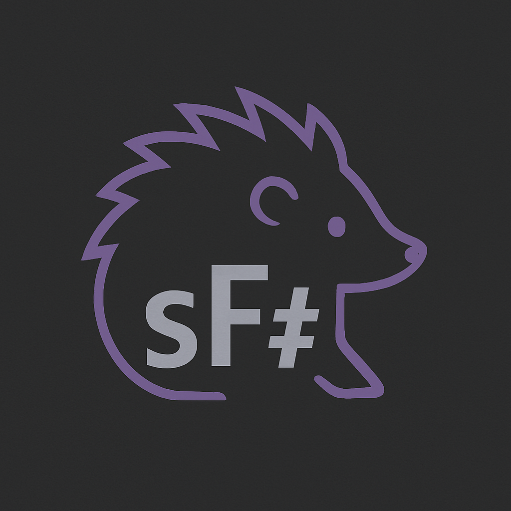

# simple-fsharp

Aimple independent implementation of F#, including a compiler (sfsc) and a REPL (sfsi). Currently uses NativeAOT to build standalone native binaries with no dependencies on dotnet runtime.

Currently implements only a portion of the F# language, but the goal is to expand this over time.

Currently requires dotnet to build, but the goal is to build it out to be fully self-hosting.

Reimplementing the .Net library is a non-goal. It's huge and object-oriented, and the plan is for a smaller library that fits F# more idiomatically.

To build, use the command:

dotnet publish -c Release -r linux-arm64 /p:PublishAot=true

Project by Tessa Norris
located at https://github.com/tessnorris/simple-fsharp
